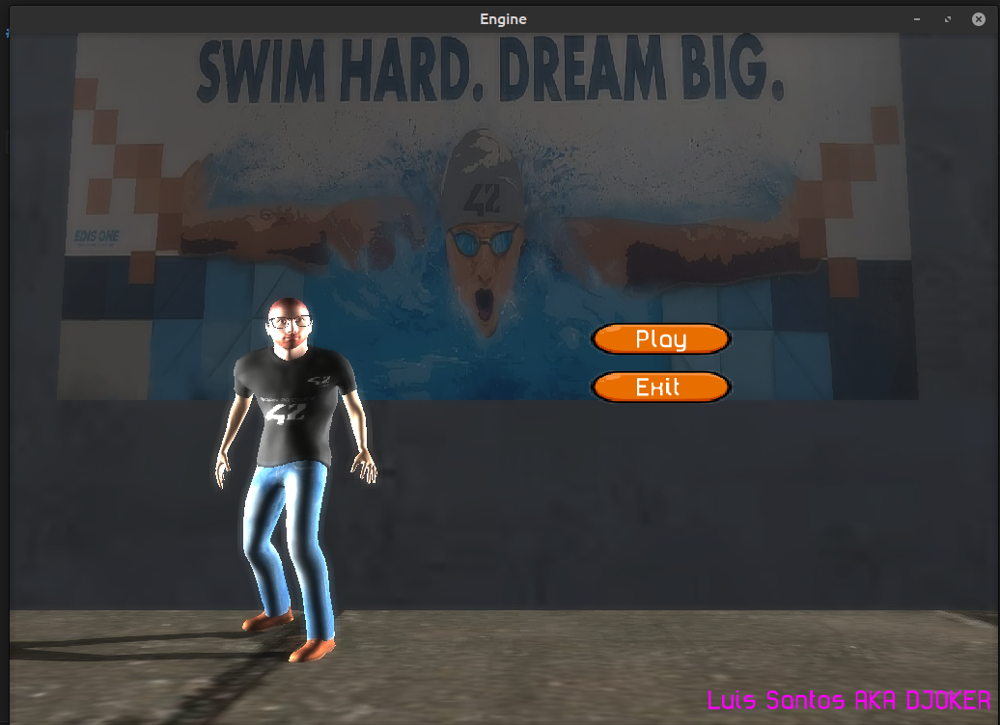
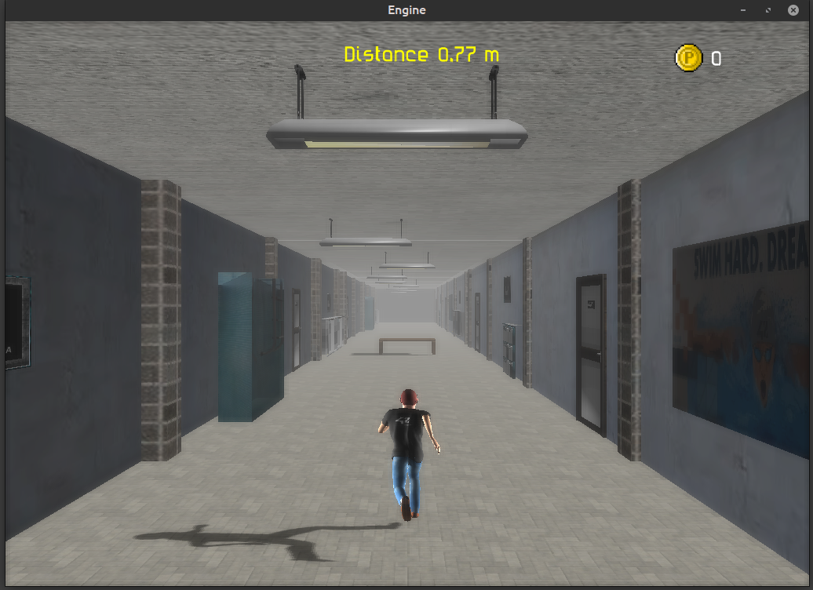

# 42 Run

24 Run is a game where the player runs through an infinite school-themed world. The game is developed using OpenGL and features advanced graphics capabilities and game logic exposed to QuickJS.

# Features
    OpenGL Graphics Engine: Advanced rendering using OpenGL.
    
    Cascade Shadow Maps: Implementation of 4 cascade shadow maps for high-quality shadows.

    One  directional light responsible for producing shadows.

    Ten lights positioned to give light to the environment.
    
    GPU Skinning Animation: Character animation using GPU skinning with support for animation mixing.
    
    Post-Processing Effects: Post-processing effects including blur and bloom.
    
    Game Logic in QuickJS: Game logic programmed in JavaScript using QuickJS, supporting live code and hot reload for easy development.
    
    Custom Mesh Format: Proprietary mesh format for static and animated meshes, containing mesh and skeleton information.
                        Unique or Multiple Animations: Each mesh can have unique or multiple animations.
                        
    Keyframe Animation: Each animation contains keyframes for the same skeletal format.

# Javascript API
    
    assets:
        load_texture            fileName
        set_texture_path        path
        set_texture_load_flip   bool
    canvas:
        set_mode    mode !lines,quad,tri 
        vertex2    x,y
        vertex3    x,y,z
        texcoord   u,v 
        set_color   r,g,b
        print           text,x,y 
        set_font         index 
        load_font       filename
        set_font_size   value
        font_clip       bool
        set_font_clip   x,y,width,height
    
        line        x1,y1,x2,y2
        circle      x, y, r [fill]
        rect        x, y, w, h [fill]
       
        set_texture index 
        draw_texture index,x,y,w,h   
    
        line3d      x1,y1,z1,x2,y2,z2
        cube        x,y,z,w,h,d, whire
        sphere      x,y,z,r, rings , slices, whire
        grid        slices, spacing,[axies=false]
    scene:
        enable_3d           bool 
        enable_2d           bool
        set_clear_color     r,g,b
        load_entity         fileName,name,castShadow
        create_static_node   name,cast_Shadow
        load_model          fileName,name
    
        remove_model        index
        remove_entity       index
        remove_node         index 
    
        get_total_nodes     
        get_total_models
        get_total_entityes
    
        get_model_id        name 
        get_entity_id       name 
        get_node_id         name 

    
        create_cube          w,h,d
        create_plane          stacks,slices,tilesX,tilesY [uvTileX,uvTileY] 
        create_quad           x,y,width,height

        node_add_model           nodeIndex, modelIndex  
        
        entity_add_animation            entityIndex, filename
        entity_play                     entityIndex, name, loop,blend
        entity_stop                     entityIndex
        entity_is_ended                 entityIndex
        get_entity_frame                entityIndex
        get_entity_animation_name       entityIndex
    
        set_entity_postion      nodeIndex, x, y, z
        set_entity_rotation     nodeIndex, x, y, z
        rotate_entity           nodeIndex, angle,x, y, z
        set_entity_scale        nodeIndex, x, y, z
        set_entity_texture      modelIndex, materialIndex, textureIndex
    
    
        set_node_postion      nodeIndex, x, y, z
        set_node_rotation     nodeIndex, x, y, z
        set_node_scale        nodeIndex, x, y, z
        set_node_visible      nodeIndex, visible

        set_model_texture     modelIndex, materialIndex, textureIndex
        set_model_name        modelIndex, name
        set_model_culling     modelIndex,layer, culling
        set_model_scale             modelIndex, x, y, z !on mesh 
        set_model_position          modelIndex, x, y, z !on mesh
        set_model_rotation          modelIndex, x, y, z !on mesh
        get_model_size              modelIndex 
        model_update_normals        modelIndex,mesh
        model_update_smoth_normals modelIndex,mesh,angleWeighted
        scale_model_texture_coords  modelIndex,layer, x,y
    
        set_light_color lightIndex, r, g, b
        set_light_position          lightIndex, x, y, z
        set_light_intensity         lightIndex, intensity

    camera:
        set_follow_mode             mode 
        set_follow_offset           x,y,z
        set_follow_position         x,y,z
        get_position                
        set_position                x,y,z
        set_yaw                         yaw
        set_pitch                       pitch
        rotate_by_mouse                 speed 
        move                            mode,speed
    
    
    core:
        screen_width 
        screen_height 
        get_time 
    
    mouse:
        down 
        pressed
        up 
        x
        y
    
    keyboard:
        down 
        pressed
        up 

# Some screenshots

License
LICENCE: DO WHAT THE FUCK YOU WANT TO PUBLIC LICENSE Version 0.0000002,

Copyright (C) 2024 Luis Santos AKA DJOKER djokertheripper@gmail.com

Everyone is permitted to copy and distribute verbatim or modified copies of this license document, and changing it is allowed as long as the name is changed.

       DO WHAT THE FUCK YOU WANT TO PUBLIC LICENSE
TERMS AND CONDITIONS FOR COPYING, DISTRIBUTION AND MODIFICATION

You just DO WHAT THE FUCK YOU WANT TO.
